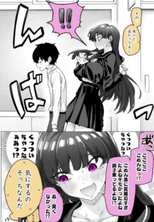
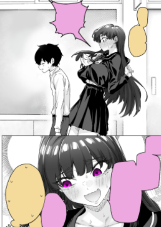

## Introduction

Welcome and thank you for your interest in redrawing for Keiretsu!

**Redrawing** enables scanlators to effectively replace Japanese text with translated dialogue, sound effects, and signs. Without redrawing, the experience of reading scanlated manga or manhwa would be very jarring as it would be annotated (overlayed on top of the raws) instead of actually being part of it.

A quick disclaimer though, **redrawing is not actually actual drawing or illustration.** It's more of an image-manipulation thing, sorry artists!

Despite this, redrawing is still quite a creative role, requiring imaginative ways to erase text in a way that its not obvious that it isn't there. The name of the game is to Photoshop out the undesired stuff.

Even though redrawing requires actual thinking at times, Photoshop's Generative Fill as well as other inpainting tools help a lot with more tedious things so if you have access to that, you'd be in for a less painful time!

There are still efficient ways that have been discovered by the ones before so I highly recommend reviewing the guides and resources below before attempting. 

[Gemelli's CLRD Textbook](https://docs.google.com/presentation/d/19kiRSTDoXd1PgOtf1QqOSQCNwO-4_Z5UHJSQnJVV4Ws/edit)

[Gradient with Speedlines](https://youtu.be/dR3d3SBYq40)

[Removing big SFX](https://www.youtube.com/watch?v=dR3d3SBYq40)

## Taking the Test

For this test, **you are required to remove and redraw all Japanese text you see, including punctuation**. If you think its text and not art, remove it.

Basically turn this:

into this:

This pages you are required to redraw are located [here](https://drive.google.com/file/d/1GeGRndGQ1-VMV0cDIp905iccG0Lx6QTh/view?usp=drive_link).

You will be required to do all four (4) pages to the best of your ability, failing is fine as long as you're open to feedback!

Our criteria will be pen tool usage for speedlines, halftone and screentone replication, basic line work, copy-pasting, and general proficiency with Photoshop (or any applicable software)

## Submitting Your Application

Congratulations! In order to submit your application, please make sure you've already joined our [Discord server](https://staff.keiretsu.cc) and open a ticket in [this channel](https://discordapp.com/channels/1131989690715754602/1167557074662731857). After opening a ticket, tell us you're applying for redrawing and submit your finished test files as .PSD's as well as exported .PNG's for accessibility. Please keep in mind that we strictly use .PSD's as it is the most commonly used format in scanlation when working with other people!

Please give us 1-3 days to go over your application. We will always tell you if you have been rejected. If you think we may have forgotten to reply, please ping @imsisig in your ticket!