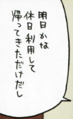
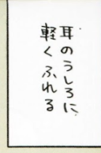
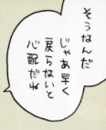
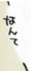
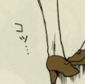

## Introduction

Welcome and thank you for your interesting Japanese Translation for Keiretsu!

**Translation** is arguably the most important role in scanlation. The entire quality of a chapter relies on how accurate the translator interprets the Japanese text and into phrases and sentences that would make sense in English.

While experience with translation is not necessary, sufficient knowledge in the fundamentals is important. This means knowledge of the basics scripts and how they're written, era-appropriate slang, and neologisms for **both** languages. This allows translators to properly read even messy handwriting, understand how the young'uns talk nowadays, and figure out which words fit best.

We *highly recommend* reading the guides and resources below (assuming you are already familiar with Japanese and English) before starting with the test to get cozy with how translation for scanlation is often done.

[Yukio's Tips and Guidelines](https://drive.google.com/open?id=127kL3bXV2QRiEfkD_TNLLikMSXkhm63b)

[Bajuwa's Guide to Cultural Translation (Chinese, applicable to any)](https://docs.google.com/document/d/1d0XMJbR_zkksXqs8UwbFi0583KuBF97A44bA6DBY1bo/edit?tab=t.0)

[Bajuwa's Introduction to Comic Translation (Chinese, applicable to any)](https://docs.google.com/document/d/1bvqLhEO8ipTnIZqHtdBpczpYMwjdfx8RmRq5YhyHZJg/edit?tab=t.0)

[TheJadedNetwork's Japanese SFX Dictionary](https://thejadednetwork.com/sfx/)

## Taking the Test

For this test, **you are required to translate every piece of Japanese text you see**. This includes but is not limited to sound effects, dialogue, narration, small text (text without bubbles or boxes), text of objects, etc.

Pages are provided [here](https://drive.google.com/drive/folders/1KIxxtq_svzHump9hcyzgGhcPtBD481-4?usp=sharing).

Criteria is basic accuracy and basic grammar. Please make your translation as readable as possible.

Please follow the format below to ensure that we know which text you are translating.

Dialogue should be denoted with “()”
Ex.
() Hello there! # Not a translation of the bubble above

Narration should be denoted with “[]”
Ex.
[] They said hello. # Not a translation of the bubble above

Split bubbles should be indicated with “//”
Ex.
[] A man has fallen // into a river in Lego City # Not a translation of the bubble above
() Woah! // They fell! # Not a translation of the bubble above

Small text should be indicated with “ST:”
Ex.
ST: Why?

SFX should be indicated with “SFX:”
Ex.
SFX: Clack

## Submitting Your Application

Congratulations! In order to submit your application, please make sure you've already joined our [Discord server](https://staff.keiretsu.cc) and open a ticket in [this channel](https://discordapp.com/channels/1131989690715754602/1167557074662731857). After opening a ticket, tell us you're applying for translation and submit your test on a .txt/.pdf/.doc/.docx or any text-based format for us to properly review it.

Please give us 1-3 days to go over your application. We will always tell you if you have been rejected. If you think we may have forgotten to reply, please ping @imsisig in your ticket!