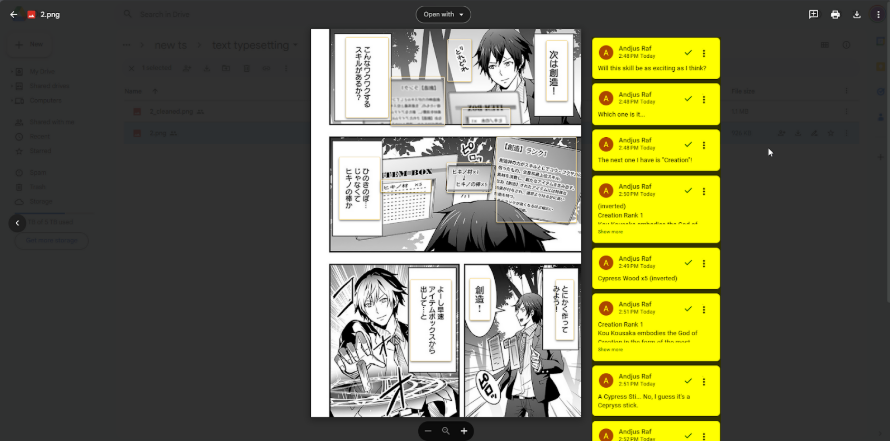

## Introduction

Welcome and thank you for your interest in typesetting for Keiretsu!

**Typesetting** is one of the core roles in scanlation and is *very important* to get right! As such, we'd love for you to *thoroughly read this guide* as it will walk you through the process of studying typesetting guides, doing the required test/s, and actually applying.

Before anything else, it is *very important* that you make an effort to skim or review on current typesetting norms.

We *highly recommend* reading [yours' Guide to Typesetting](https://docs.google.com/document/d/1Ss6AW07S8onlS1-SbgyoF4w1ve285B2fVqsgOtkKuLk/edit?usp=sharing) before attempting the test. **Everything you need to do regarding typesetting is comprehensively explained in it.** The things we look for when considering applicants is also detailed in the guide and most of our feedback will be pointing out deficiencies in the fundamentals.

## Taking the Test

For this test, **you are only required to typeset the translated text.** If you see Japanese text with no translations attached, you are free to ignore it. You are required to typeset the translated text unto the cleaned pages, provided [here](https://drive.google.com/drive/folders/1e9nOBPJobHKyl953ARKAzUeTY6_tQjBc?usp=drive_link).

You are also encouraged to change up the script, provided that you don't change tone or intention. *You are allowed to shorten or lengthen sentences by ommiting, adding, or changing words for better shaping!*

The translations can be found [here](https://drive.google.com/drive/folders/17u6A-55-ldFI_Hi5ZaolBLPxPCc7gMT8?usp=drive_link). The script may contain one or more errors. We appreciate individuals who do not let such errors slide, however, this will not be a prioritized factor in your application.

*The translations are on the image directly.* Though you may need to use a functional modern browser for this to work properly.

You are able to click on either the comments in the area highlighted in yellow (shown above) or click on the bubble itself to check its translation (shown below).

## Fonts

The fonts provided are part of your test. If you consider any of the chosen fonts unsuitable, you are free to change them.

You can download all fonts below right away [here](https://drive.google.com/drive/folders/1Sk90sydcs-cL4s_WFxcOqfkhnt67dPgA?usp=drive_link).

**Page One**
Narration (Boxes) - [BB Back Issues Regular](https://drive.google.com/file/d/1Aho89KenGoZj_miW1mu1GtsI5gL9onpd/view?usp=drive_link)

Dialogue (Bubbles/Ovals) - [BB Anime Ace 2.0 Regular](https://drive.google.com/file/d/1-5LC3qVsWh7JlbO0BBxT_ly1eti2zFad/view?usp=drive_link)

Small Text (Text outside normal bubbles or boxes) - [DK Bupkis Regular](https://drive.google.com/file/d/1p1-p7_QuqRd8ask6IDWD_vXBNupGZyDJ/view?usp=sharing)

Panel Text (Text on in-story game panel) - [CC StandBy4Action Regular](https://drive.google.com/file/d/11HWc1bQ2c8XQIKIfAyBvDW3uUqPuVUsp/view?usp=drive_link)

**Pages Two to Four**
Narration (Text outside bubbles, no box) - [Marker SD Regular](https://drive.google.com/file/d/1bqv-iilI-hasaNOSec1k4EcZ-vOUTLpv/view?usp=drive_link)

Dialogue (Bubbles/Ovals) - CC Victory Speech ([Bold](https://drive.google.com/file/d/1ZB3_05XrlJBJVfGi33spZM2nPDOHTEUX/view?usp=drive_link) / [Italics](https://drive.google.com/file/d/10VibGrLpVJRSORdYZfaw688nK1Bu1ESm/view?usp=drive_link), depends on raws.)

Small Text - [CC Wiccan Sans Regular](https://drive.google.com/file/d/1FV0lb_HDJqszxc-fqXBY8HHWx03vMLvs/view?usp=drive_link)

## Submitting Your Application

Congratulations! In order to submit your application, please make sure you've already joined our [Discord server](https://staff.keiretsu.cc) and open a ticket in [this channel](https://discordapp.com/channels/1131989690715754602/1167557074662731857). After opening a ticket, tell us you're applying for typesetting and submit your finished test files as .PSD's as well as exported .PNG's for accessibility. Please keep in mind that we strictly use .PSD's as it is the most commonly used format in scanlation when working with other people!

Please give us 1-3 days to go over your application. We will *not* reject applicants by not replying. If you think we may have forgotten to reply, please ping @imsisig in your ticket!